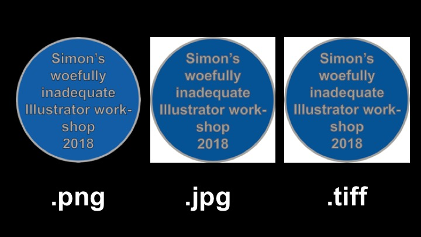

# Introduction

This document provides a companion and cheat-sheet for the material on Adobe Illustrator (AI) we will cover today. It covers basics of the program (with no claim to be comprehensive) and is hopefully structured in a way that will allow you to go back and check on specific issues you may (read: will inevitably) encounter along your journey. If you have suggestions, comments, or criticisms on the document or find any flaws with it, please give me heads-up.
To replicate everything, you will need the *tidyverse*, *ggpubr*, and *emo* package. 

The document follows a pretty simple setup:
 
1. **Basics**: learn about file formats, color modes, artboards and more
2. **Tools**: familiarize yourself with all the different symbols
3. **Objects**: have a go at creating various objects
4. **Modification**: gain insights into how you alter aesthetics of plots

The four sections should give you a decent foundation to start exploring the usefulness of Adobe Illustrator for the creation of silhouettes, flowcharts, diagrams, or infographics, and will also equip you with the knowledge you need to make modifications to figures that are exported from R (via ggplot). Let's begin!


# 1. The Basics
...aka: duh!

## a. Vector graphics
Adobe Illustrator is a *vector graphics editor*, which means that it essentially creates images (or the illusion thereof) using a sequence of commands/functions/equations that arrange whatever objects you specify into a two-dimensional (and sometimes even three dimensional) space. In other words, anything you do in Illustrator is really just translating into complex code that specifies what ought to go where. Wacky, I know. That doesn't necessarily have to concern us, but it has important ramifications for understanding both the basic ways of using AI and the formats it spits out. For the use of the program, it means that we work exclusively with three "things": **anchors**, **edges**, and sometimes **handles**. Anchors are "points" you can place on your screen that, well, act as anchors to your drawings. They can (unless otherwise imposed) be moved independently and freely. Anchors can exist without edges. Edges, in turn, are what we commonly think of as "lines" that connect the anchors. They do not exist without anchors and moving anchors always affects its edges -- think of them as very stiff ropes attached to anchors. Finally, handles are like "levers" that we can use to modify the shape of edges between anchors by pulling and rotating them. Consider the example below, which consists of three anchors and two edges. In the left plot, all edges are straight between the anchors. However, in the right plot, I have played with the handles of the third anchor, essentially bending the edge between the two anchors to form a curve.

 
Any objects you will create in AI are based on these three elements, so now is a good time to familiarize yourself with them and remember the fact that they are essentially just a figment of your imagination and in reality just a bunch of code and maths... Just kidding, don't do that. But, recall that the beautiful grey star that you see below is, in fact, just a whole pile of anchors and edges that I have instructed to outline an area that I want to be grey.

 

  


All of this math means, of course, that we have to be careful how exactly we save the information we create. This leads us to the next part, which is all about different filetypes. I know, sounds riveting. If you want to spend countless hours working in AI and then render all of your work absolutely and entirely useless with a single click, feel free to skip the next section...

## b. Filetypes
Due to the aforementioned properties of AI you may encounter a variety of different files. These vary in their usefulness, application, purpose, and transferability, so it's important to have an idea about what you can produce. The table below lists the seven filetypes that I most frequently use and encounter.

Filetype                   |Extension|Modifiable  |Used for         |Opens in        |Preservation    |Artboard/Background| Execute via  |
---------------------------|---------|------------|-----------------|----------------|----------------|-------------------|--------------|
Adobe illustrator          |.ai      |Yes         |Editing in AI    |AI              |Version-specific|irrelevant         |Save as       |
Portable document format   |.pdf     |Yes         |All documents    |AI, PDF viewers |Always          |maintained         |Save as       |
Encapsulated post script   |.eps     |Yes         |HQ Journal figs  |AI, PDF viewers |Always?         |irrelevant         |Save as       |
Scalable vector graphic    |.svg     |Yes         |Websites, videos |AI, Browsers    |Always?         |irrelevant         |Save as       |
Portable network graphic   |.png     |No          |Word, PowerPoint |PDF viewers     |No              |irrelevant         |Export        |
Joint photographics group  |.jpg     |No          |Word, PowerPoint |PDF viewers     |No              |background visible |Export        |
Tagged image file          |.tiff    |Possibly    |HQ Journal figs  |PDF viewers     |No              |background visible |Export        | 

The properties of these filetypes are REALLY important for how you will be able to work with them and what you should be using them for. In short, the first four are all *vector-based formats*. Thus, **they actually save the math and equations behind your artwork** to ensure that you can modify all the bits and pieces in them at any time in AI. In other words, if you save them as vector-based files, you will have full access to all the anchors, edges and handles you can handle. However, they can be limited in their functionality for other purposes. .ai files for example can't be opened outside of AI (but .pdf and .eps can) and newly created files can become incompatible with older versions of AI (but not *vice versa*). In contrast, the bottom three filetypes are the ones classically used for multimedia imagery, but they are NOT editable in AI. Other important quirks relate to how the background and artboard is treated. .pdf documents are awkward because they preserve the entire artboard (no matter where your graphic is, see below); .png provides transparent backgrouds (useful for silhouettes etc. in presentations), while .jpg always has a white background (see figures below). I generally use:

* .ai files as my original file 
* .eps files to submit figures to journals
* .png files to embed into Microsoft documents
* .jpg files if I send figures separately in emails

I rarely use .pdfs because of their artboard properties, even though they're ultimately the most versatile format. The only context in which I have used .svg files is for making a video in [Sparkol VideoScribe](https://www.videoscribe.co/en/), because it allows the program to trace the different lines I have drawn.



 

Speaking of the artboard...


## c. Document setup
Illustrator provides you with a blank artboard (basically just a big old canvas) every time you open a new document. This canvas is marked by a white rectangle on grey background and can be defined in any size or aspect ratio you can imagine (you can see it under the grey box below). When you create a new document (left panel below), there are a couple of things to be mindful of (although you can change all of it later as well). 


Since you can infinitely zoom in and out of your artboard, the size doesn't really matter while you're working in AI, but it sure is important when you save/export your file. I generally start with an A4-sized canvas (either portrait or landscape, middle panel), which makes sure that I'm somewhere within reasonable size-dimensions. The other thing to notice is the "Units" part. Setting this *a priori* can prevent extra work or awkwardness later on, for example when you're trying to fit your figure to the 89mm single column width specified by Nature (but your drawing is currently as wide as all issues Nature stacked on the world's longest bookshelf), or when you're rocking up at a conference to present a poster (but the poster was printed with the 89mm width of a single-column figure in Nature). Finally, make sure you set the color mode and resolution at the start (right panel). You want this to be **RGB** and **NOT CMYK** (unless you're making a poster). CMYK color format belongs to the same generation as facsimiles, N*SYNC, and the patriarchy -- hopelessly old and outdated. Realistically though, CMYK is used for print only (I'll spare you the details), whereas RGB is the right color mode for everything on a screen. Thus, for most of our applications (PowerPoints, manuscript figures published online, etc.), RGB is the better choice. Failure to adjust this can result in really awkward changes in color (see below). 


If you find that you're selecting a color that doesn't end up looking the same afterwards, then it is usually because you're in CMYK color mode. In the color selection panel below (don't worry about how to get there yet), you can see a little exclamation mark by the color and an alternative color below the one selected (white arrows). That's a clear indication that something's not right in your color mode. 


Oh, and finally, don't have a figure published in CMYK color mode while all the other ones are RGB. Makes you look like an idiot... uhm...


This just about wraps up the basics of what you need to know. Armed with that knowledge, let's take a look at the tools mwe have at our disposal.

# 2. The Tools
aka. SO.MANY.SYMBOLS!!!!!

Being developed for professional cyber-artists (i.e. not dopey scientists), AI has a huge range of tools that allow you to do just about anything. Luckily, for our purposes, we only need to know a relatively small subset of tools and symbols, which saves us from having to complete another degree in our spare time. Broadly, you can access different tools in three different areas:

a. The left side of your screen

b. The right side of your screen

c. The menu bar on top

Of course, pretty much all of them are also accessible via...

d. Keyboard shortcuts

I will go through them in sequence below.

## a. To the left, to the left... 


The left toolbar is the bread and butter of your work in AI, as it contains all the tools that let you actually **create** things. This is not a perfect rule, but if you're looking to produce anything from scratch (as opposed to modifying existing objects), you will inevitably find the tool to do it on the left side. Let's have a look at our options, shall we.


### I. Grab & move


The two arrows here will be your most frequently used tools, regardless of what you're doing. As the name suggests, you use these two arrows to select objects on your canvas and move them around at your hearts desire. There is, of course, a difference between the two. The black arrow **always selects entire groups of anchors and edges**, whereas the white arrow allows you to **select specific anchors, edges, or handles**. That means, if you wanted to create an awkardly distorted version of the star I made earlier (see below), you would select the **white arrow** to move around anchor points. However, if you, for example, wanted to make smaller versions of the decapitated and blunted star-specimens, you would use the **black arrow** to select, copy-paste, and resize the objects. Note that both of them let you drag rectangles to select either multiple objects (black arrow) or multiple anchor points and edges (white arrow). Also note that if you use the white arrow on an object without hitting an anchor or edge, you will selecte all anchors in the object and can therefor move the entire thing around.


### II. Artisanal selections


While the two arrows are either an "all-or-nothing" kinda thing (black arrow) or an extremely coarse way of selecting multiple anchors (via a dragged rectangle with the white arrow), the two tools below them are the hipsters among selection tools (pretty certain they roast their own coffee beans, have man buns, and eat copious amounts of avocado toast). In short, you can use them to select sub-groups of objects or anchor points that are not easily captured by a rectangle. The **Magic Wand** does so by using code that defines objects as similar or not, automatically selecting things that look the same (based on color, stroke, opacity, etc). The **Lasso** tool does so by letting you make a free form (i.e. a lasso... yeeeeeehaaaaaw) that encompasses all the anchor points or objects you wish to select. Consider the graph below:

```{r Random dotplot}
library(tidyverse)
library(ggpubr)
library(emo)
x <- rnorm(500, mean = 10, sd = 5)
y <- rnorm(500, mean = 10, sd = 5)
z <- c(rep(1, 100), rep(2, 100), rep(3, 100), rep(4, 100), rep(5, 100))
data <- as.tibble(cbind(x,y,z))

randomplot <- ggplot(data, aes(x = x, y = y, color = as.factor(z))) +
  geom_point(size = 2) +
    theme_bw() + theme(panel.grid.major = element_blank(), 
                     panel.grid.minor = element_blank(),
                     axis.title = element_text(size=14),
                     axis.text.x = element_text(size = 14),
                     axis.text.y = element_text(size = 14),
                     legend.position="none") +
  scale_color_manual(values = c("dodgerblue", "yellowgreen", "black", "orchid", "gold"))
randomplot
ggsave("RandomDotplot1.pdf", randomplot, width = 7, height = 5, useDingbats = F)
```

As a silly example, you find that for your manuscript submitted to Nature, Reviewer 3 (it's always Reviewer 3) wants you to change the color of your dots (it's a critical issue) and for some reason, your R-code has gone walkies. Wouldn't it be nice to be able to automatically select all of the black dots and change their color? Well, the magic wand can do just that. Voila! We thank Reviewer 3 for his/her suggestion and find that this has dramatically improved our manuscript.


Similarly, if you wanted to change just a spatially defined subgroup of points (ummm, don't just change points in a graph, as a sidenote), you can use the lasso tool to accomplish that. 


### III. Free anchors


The two pen tools are the workhorse tools for anything you're attempting to draw by hand. This includes all of the silhouettes that you will draw after this workshop and means that you will have to practice using these tools quite a bit. I exclusively use the **Pen Tool** -- I actually think the **Curvature Tool** is a feature of newer AI versions, but it essentially just helps draw pretty curves, which I don't normally need (or use the "Arc Tool" for). In essence, with every click, you set an anchor point on your canvas. Wherever you move your mouse next, you will now (as of the 2015 CC version) see an edge that is automatically calculated. If you click again, said edge actually solidifies, but you can still shape it my keeping the mouse-click alive and moving the handles around. This may sound abstract, but will be fairly intuitive. A few notes about these drawings:

* The pen tool automatically creates lines that you can color, but you will only be able to fill drawings that are closed, i.e. where your anchor point of origin is also your final anchor point
* By default, it has both the fill (fill color) and stroke (line color) selected. I will get to this shortly, but for now just hit the white square with the red diagonal line on the bottom left (see below)
* You can stop-and-go by simply clicking the last anchor you set
* The handles affect both the previous and the next edge by distorting it accordingly. If you don't want the distortion to affect your nect edge, simply clikc the last anchorpoint to nix the handle.
* try not to make funky loops, they're really annoying


Another thing you'll see is that the Pen Tool has a little white triangle on the bottom. That means, there's more to unpack! Yay, it's like Christmas! If you click and hold the pen tool, this little menu appears: 

(Note: if you're ever missing a certain tool, chances are you used a tool that's usually hidden inside the toolbox and it has temporarily replaced the main symbol.)


As you may have guessed, you can use these tools to add and delete anchor points, or to make an anchor point "live" again. In short, when you set an anchor point without holding the mouse to create handles, the anchor loses its handles. You can re-introduce those by clicking the anchor with the Anchor Point tool.


### IV. Text and lines


The **Type Tool** and **Line Segment Tool** don't really go together as nicely as the previous ones, but are both pretty straightforward. The text tool allows you to create and modify text on your illustrations or graphs. It comes with nearly the entire set of functions that you get from a regular text processing program (colors, fonts, subscript, superscript, etc), but on the left side of the symbols, we're only concerned with actually putting words on paper errr canvas (um.. screen, actually). It does have a bunch of other tools in the box with it, which mainly allow you to align text in different ways (i.e. inside an object, along a path, etc -- see below)


The **Line Segment Tool**, in turn, does excatly what one would think it does. It makes straight lines using two anchor points and an edge in between. It also has some different reincarnations, like the **Arc Tool**, which makes nice little curves, the **Spiral Tool**, which is particularly popular among malacologists, the **Rectangular Grid Tool**, a handy one if you need to draw nets and other things, and the **Polar Grid Tool**, which may not be the most useful tool in the world. 


### V. That's not the shape of my heart


The **Square Tool** is a bit of a misnomer, really, since it harbors a panoply of different shapes beyond rectangles. Very similar to all the other tools, it creates thes shapes by setting geometrically fixed anchor points and then, by default, fills the area in between the edges. You can drag these shapes to the preferred size or enter a pre-defined size on the first click. We're going to disregard the tool on the right (unless you want to go full Vincent van Gogh on me), and instead take a look at all the other shapes we can make. This includes rounded rectangles (**Rounded Rectangle Tool**), circles and ellipses (**Ellipse Tool**), polygons with the number of corners to be defined (**Polygon Tool**), stars with the number of corners (?) and their radius specified (**Star Tool**), and, last but not least, the single least useful tool in the entire program: the **Flare Tool**, for when you have to make a really weird, completely random, spacey kind of universe thingy... go figure...  


### VI. Other bits and bobs
First, there are two more critical icons (or sets of icons)  in left toolbar. These are the Zoom-Tool (highlighted by the magnifying glass) and the color selector panel. I would wager that you will never actually click the zoom-tool. All you need to do is use Command-+ and Command-- to go as close or as far away from your canvas as you may desire. In contrast, you will constantly use the color selector panel. the top left square stands for "Fill" and the bottom right stands for "Stroke". You can choose each color by double-clicking on the respective square. You can do a switcheroo by hitting the double-headed arrow. You can get rid of either or by hitting the white square with the red dash. And you can implement a gradient by hitting the faded square in the bottom center. 


Beyond these two, there's of course a whole armada of other handy tools that vary in their usefulness for our purposes. I'm highlighting a few that you may find quite useful in your sci-artsy endeavors. This includes the: 

• **Live Paint Bucket Tool**

• **Eyedropper Tool**

• **The Graph Tool**


#### The Live Paint Bucket


The Live Paint Bucket tool is really handy when you are working with colors, but takes a while to wrap your head around. In essence, it allows you to partition your object along non-continuous paths to essentially get a "Drawing-by-Numbers" template. For example, if you have a rounded rectangle and draw a wavy line through it (see below), and then you want to color the bottom part differently from the top, you're in trouble because the wavy line and the rounded rectangle are different objects. However, if you select both objects and hit Command+G (which is a shortcut for grouping objects) and then click somewhere on these objeccts with the Live Paint Bucket tool selected, you will be able to separately fill in each part of the mosaic with separate colors. This is a fairly simplistic application...


...but you can do some really nice and complex stuff with this tool (such as the Figure and separate elements from Casey et al. 2017 below). It takes a fair bit of patience and might result in tendinitis in your finger, but the results can be quite satisfying and the process is rather therapeutic. For example, you can draw a pretty fish...


#### The Eyedropper


The Eyedropper tool is fairly easy to grasp. If you want to match an existing color (e.g. the color of a dot on a fish), use the eyedropper tool. Not rocket science.


#### The Graph Tool


I would strongly advise against using this tool to make publication quality graphs, but if you're making conceptual figures for which the numbers don't matter all that much or, god forbid, piecharts `r emo::ji("scream")``r emo::ji("scream")``r emo::ji("scream")`, this can actually be rather useful (see below). The charts let you fill in your own data by hand and even lets you import a .csv file. In the interest of reproducibility, I'd keep this one rather simple...


This will suffice as a glimpse into the tools on the left. So let's soldier on to the right side of the board.

## b. Right now...


While the left toolbar was mostly for creating objects from scratch, the right toolbar is more for the modification of existing objects. Specifically, if you want to change the color, stroke, or opacity of your objects, look to the right and you should find what you're looking for. Caveat here is that the right toolbar is quite customizable. If you're missing one (stroke, gradients, and opacity are the ones that you're probably most concerned with, hit 'Window' in the top menu and drive down the list until your section of choice appears. For the sake of practicality (and given my highly subjective experience of what's useful), I will only highlight three sections here.

### I. The stroke panel

Here, you can modify the edges between your anchor points. In relatively broad strokes (har har), you can change your strokes to have the desired thickness, stroke type, dashing patterns, or arrowheads. It's a really useful panel, so familiarizing yourself with it might be helpful. 


Most importantly, you can set the weight of your stroke (which also usually appears in the top row of your AI) to any decimal degree you want. Second, you can specify what you want the cap of your stroke to look like (particular emphasis on the "Butt Cap" option here -- yeah, I'm juvenile) -- note that this one will really be quite innocuous when the stroke is light. Third, you can specify the dashing pattern -- you can go nuts here, the possibilities are endlessly customizable. Fourth, you can put arrow caps and some other weird symbols to either end of your stroke and modify the size of the end symbol (an infinitely better solution that the ugly-arse arrows that PowerPoint offers). Finally, you can also change the type of stroke, but I've only used this one in rare circumstances. Of course, you can adjust the colors as needed and even have some nice gradients in your strokes...  Gradients you say?


### II. The Gradient panel

The Gradient panel, as the name suggests, offers options for mixing up colors. It's a bit non-intuitive to get to setting the actual colors. 


As you can see, it automatically assumes a black-to-white gradient. To change that, click the little list icon in the top right (orange circle) and select "RGB" from the available color modes. That will allow you to choose from all the colors your heart may desire. Note that you can change the type of gradient from "Linear" to "Radial". You can also change the orienatation of the gradient or the placement of the little sliders. You can also adjust the abruptness of the gradient by clicking and dragging the little diamond on top of the gradient (blue circle) or add another gradient slider by double-clikcing anywhere between the white and the black sliders on the bottom.